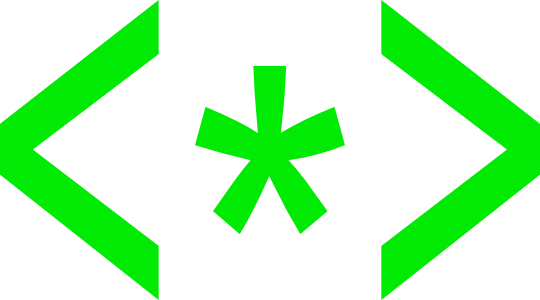

#  TrekBasic


TrekBASIC is both a full [BASIC](https://en.wikipedia.org/wiki/BASIC) interpreter, written in Python, and a BASIC compiler, via LLVM.

My goal was to be able to play the old [Super Star Trek game](https://en.wikipedia.org/wiki/Star_Trek_(1971_video_game)),
which was written in BASIC, hence the name **TrekBASIC**. I have achieved that goal. 

TrekBasic is a full BASIC implementation, you should be able to run other programs. 
The challenge with older programs is there are so many different versions of BASIC. **BASIC**ly, every machine had its own version of BASIC,
and every operating system did as well. 

TrekBasic uses dialects (see basic_dialects.py) to support different versions of BASIC. This cannot cover every case but makes it easy to adapt TrekBasic to your program, 
rather than having to adapt your existing program to some arbitrary version of BASIC.

## TrekBasic Family
TrekBasic is part of the TrekBasic family of BASIC programming tools.

| LOGO                                                                                                                                           | Project                                                    | Description | Language | Interpreter | Compiler |
|------------------------------------------------------------------------------------------------------------------------------------------------|------------------------------------------------------------|-------------|----------|-------------|----------|
|     | [TrekBasic](https://github.com/cocode/TrekBASIC)           |Basic compiler and interpreter| Python | Yes | Yes      |
|                         | [TrekBasicJ](https://github.com/cocode/TrekBasicJ)         |Basic compiler and interpreter|Java|Yes| Yes      |
|                          | [BasicRS](https://github.com/cocode/BasicRS)               |Basic compiler and interpreter|Rust|Yes| Yes      |
|  | [BasicTestSuite](https://github.com/cocode/BasicTestSuite) |A test suite for Basic|BASIC|-| -        |
|                      | [TrekBot](https://github.com/cocode/TrekBot)               |A tool to exercise the superstartrek program|Rust|-| -        |

All versions, interpreted and compiled, are intended to by byte-by-byte compatible, but are not
there yet - but they are close. TrekBot and BasicTestSuite are part of the
plan to ensure full compatibility.

## To play:

### Interpreted

```python -m trekbasicpy.basic programs/superstartrek.bas```


#### uv
uv is a newer tool for python packaging. With uv, you don't have to set up a virtual environment.

if you have uv installed, you can do:

```PYTHONPATH=. uv run --no-project trekbasicpy/basic.py programs/superstartrek.bas```


### Compiled 

```python -m trekbasicpy.tbc programs/superstartrek.bas```

Note that tbc.py just generates LLVM IR code, and uses clang to compile it. You'll need to have clang installed.

# Documentation
See the documentation folder for more docs and development info.

# Features

TrekBASIC actually provides a full basic development environment which has:
* Code breakpoints 
* Data write breakpoints 
* Single stepping
* Execution timing 
* Execution tracing
* [Code coverage reports](images/coverage.png)
* Reformatting
* Renumbering

# Profiling
You can profile the interpreter's code using python profilers. 

I have used cProfile and gprof2dot.py. You'll need to install gprof2dot.py 
I don't have dot installed, I just found an online version, and used that. 

    python -m cProfile  -s tottime trek_bot.py 
    python venv/lib/python3.9/site-packages/gprof2dot.py -f pstats test.pstats

# Getting Started
See the documentation directory for more information.

TrekBasic requires python 3

    python basic.py programs/superstartrek.bas

*HINT* If you don't put your shields up, the first hit will kill you! :-)

# Developing in BASIC

If you want the development environment, similar to what you would have had with a command line BASIC

    python basic_shell.py

Use "help" to get available commands, like "load programs/superstartrek.abs" and "run". 

I have not implemented an editor in basic_shell. You can input individual lines, but there is no editing.
While the old-style line-by-line editing might be nostalgic, modern editors are *so* much better. 
You can edit in your favorite editor, and paste in changes to the shell, or just run them directly.

# Justification

I considered simply porting Star Trek to Python, but 
writing an interpreter sounded like more fun.

## Currently Supported

TrekBASIC currently runs only programs/superstartrek.bas

* supertrek: http://www.vintage-basic.net/bcg/superstartrek.bas

It's not that we don't want to add support for other versions of Star Trek, it's that other versions of Star Trek
require other, incompatible basic interpreters/compilers. It's not a matter of needing more features, it's a matter
of need different versions of existing features. (e.g. array indexes start at zero instead of one)
